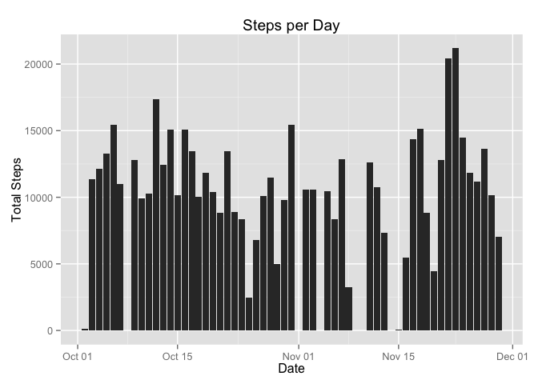
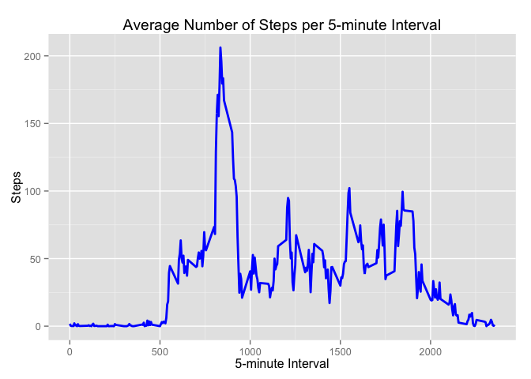
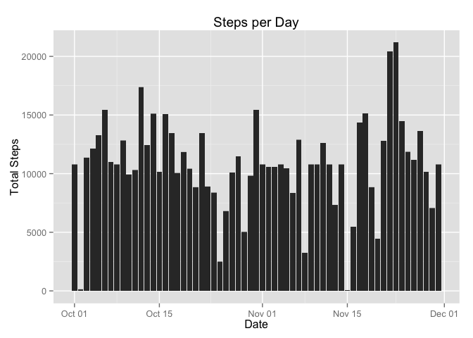
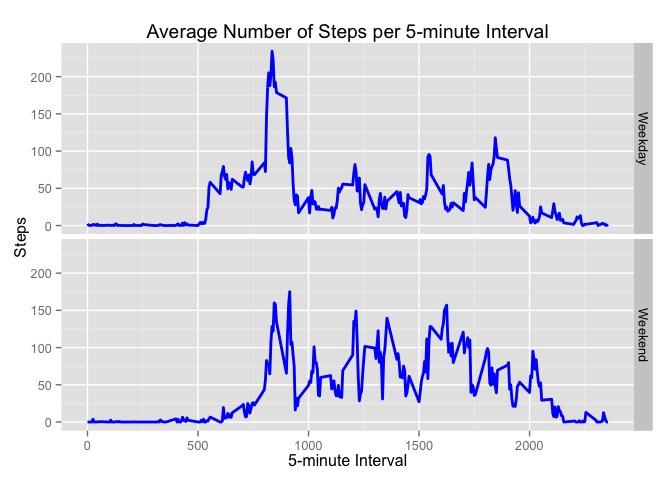

# Reproducible Research: Peer Assessment 1


## Loading and preprocessing the data
The provided activity data file should be unzipped (using the unzip command at the terminal if required) and placed in the same directory as this file.  This directory should also be set as the working directory for r.

The code below will read the CSV file and convert it into a data.table for further processing.


```r
echo = TRUE

#Libaries needed for the assignment
library(data.table)
library(ggplot2)

data <- read.csv("activity.csv")
data <- data.table(data)
```

## What is mean total number of steps taken per day?

```r
echo = TRUE

#Remove observations with NA for steps
daily_data <- data[!is.na(steps)]

#Aggregate observations by date
daily_data <- daily_data[,sum(steps),by="date"]
setnames(daily_data,"V1","steps")
daily_data <- daily_data[,date := as.Date(date)]

#Display median and mean data
summary(daily_data[,steps])
```

```
##    Min. 1st Qu.  Median    Mean 3rd Qu.    Max. 
##      41    8841   10760   10770   13290   21190
```

```r
#Plot daily step Counts
ggplot(daily_data,aes(date,steps)) +
    geom_bar(stat="identity") +
    ggtitle("Steps per Day") + 
    xlab("Date") +
    ylab("Total Steps")
```

 

## What is the average daily activity pattern?

```r
echo = TRUE

#take a mean of every five minute interval removing missing values
daily_pattern <- data[,mean(steps,na.rm = TRUE),by="interval"]
setnames(daily_pattern,"V1","steps")

ggplot(daily_pattern,aes(interval,steps)) +
    geom_line(color="blue",size=1) +
    ggtitle("Average Number of Steps per 5-minute Interval") + 
    xlab("5-minute Interval") +
    ylab("Steps")
```

 

```r
#Print the interval with the highest average number of steps
index <- max(daily_pattern[,steps])
daily_pattern[steps == index]
```

```
##    interval    steps
## 1:      835 206.1698
```


## Imputing missing values

```r
echo = TRUE

#Calculate the missing values in the dataset
nrow(data[is.na(steps)])
```

```
## [1] 2304
```

```r
#Create a new dataset substituting interval means for NAs
modified_data <- data
index <- which(is.na(modified_data$steps))
interval_index <- modified_data$interval[index]
dp_index <- match(interval_index,daily_pattern$interval)
dp_steps <- daily_pattern$steps[dp_index]
modified_data$steps[index] <- dp_steps
modified_data <- modified_data[,date := as.Date(date)]

#plot the new data
ggplot(modified_data,aes(date,steps)) +
    geom_bar(stat="identity") +
    ggtitle("Steps per Day") + 
    xlab("Date") +
    ylab("Total Steps")
```

 

```r
#Aggregate observations by date
modified_daily_data <- modified_data[,sum(steps),by="date"]
setnames(modified_daily_data,"V1","steps")
modified_daily_data <- modified_daily_data[,date := as.Date(date)]

#Display median and mean data
summary(modified_daily_data[,steps])
```

```
##    Min. 1st Qu.  Median    Mean 3rd Qu.    Max. 
##      41    9819   10770   10770   12810   21190
```


## Are there differences in activity patterns between weekdays and weekends?

```r
echo = TRUE

#Prepare data for weekly pattern analysis
weekday_pattern <- data[,weekday := weekdays(as.Date(date))]
weekday_pattern[weekday == "Sunday" | weekday == "Saturday",weekday := "Weekend"]
weekday_pattern[weekday != "Weekend",weekday := "Weekday"]
weekday_pattern <- weekday_pattern[,mean(steps,na.rm = TRUE),by="interval,weekday"]
setnames(weekday_pattern,"V1","steps")

#Craeate as pair of plots to compare the data
ggplot(weekday_pattern,aes(interval,steps)) +
    geom_line(color="blue",size=1) +
    ggtitle("Average Number of Steps per 5-minute Interval") + 
    xlab("5-minute Interval") +
    ylab("Steps") +
    facet_grid(weekday ~ .)
```

 
